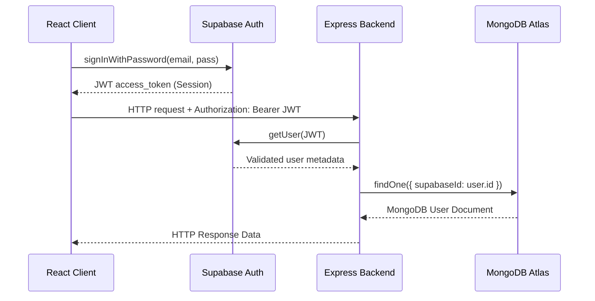

# NexaCart Supabase Integration Documentation

This document describes the architectural layout, authentication sequence, storage logic, and realtime messaging configurations implemented during the Supabase integration.

---

## Architecture Diagram

The integration uses a **Hybrid Stack**:
- **MongoDB Atlas**: Serves as the primary operational database for business models (Products, Carts, Orders, Coupons, Tickets).
- **Supabase**: Powers user authentication, secure media storage, realtime broadcast channels, and alert notifications.

```
                  ┌──────────────────────┐
                  │   React Front-End    │
                  └──────────┬───────────┘
                             │
            ┌────────────────┼────────────────┐
            ▼                ▼                ▼
     ┌──────────────┐ ┌──────────────┐ ┌──────────────┐
     │Supabase Auth │ │Express Server│ │Supabase Real │
     │  (Session)   │ │  (MERN API)  │ │ (Broadcast)  │
     └──────────────┘ └──────┬───────┘ └──────────────┘
                             │
                     ┌───────┴───────┐
                     ▼               ▼
              ┌──────────────┐ ┌──────────────┐
              │MongoDB Atlas │ │Supabase Stor │
              │(Transactions)│ │   (Media)    │
              └──────────────┘ └──────────────┘
```

---

## 1. Authentication Flow

Authentication has been migrated from local Mongoose credentials verification to **Supabase Auth**.

### Signup Sequence
1. The client registers email and password using `@supabase/supabase-js`'s `signUp()`.
2. Supabase registers the user credentials and sends an validation email verification.
3. The frontend calls `/api/auth/sync` on the Express backend passing the Supabase UID and metadata.
4. Express saves/initializes the corresponding user document in **MongoDB**, setting sparse fields like `walletBalance` ($100 welcome credit) and generating a custom referral code.

### Login Sequence
1. The frontend authenticates credentials via Supabase `signInWithPassword()`.
2. Supabase responds with the session access token (JWT).
3. The frontend includes this JWT as a `Bearer` token in the `Authorization` header for all backend REST requests.
4. The backend `protect` middleware decodes this token via `supabase.auth.getUser()`, validates the session, maps the `supabaseId` to a user record in **MongoDB**, and sets `req.user`.



---

## 2. Storage Flow (Image Uploads)

Images are uploaded to Supabase Storage Buckets instead of legacy local server folders.

### Storage Buckets Configured:
- `products`: Product media uploads.
- `users`: User profiles (avatars).
- `brands`: Brand storefront logos.
- `categories`: Category display images.
- `banners`: Dashboard promotion slides.
- `documents`: Customer invoices or support ticket attachments.

### Upload Sequence:
1. In the **Admin Dashboard** (Product modal) or **Profile Page**, the user selects a file.
2. The client uploads the file directly to the Supabase Storage bucket using `storageService.uploadToSupabase()`.
3. Supabase Storage writes the media to its object store and returns the path.
4. The client retrieves the public URL using `supabase.storage.from(bucket).getPublicUrl(path)`.
5. The public URL is saved to MongoDB (e.g., inside the Product's `images` array or User's `avatarUrl` field).

---

## 3. Realtime Broadcast Flow

Since MongoDB is the primary transactional engine, standard Supabase Postgres Replication is not used. Instead, a **Broadcast-Channel Publisher** pattern is implemented in the Express backend.

```
┌─────────────────┐       writes       ┌───────────────┐
│ Express Server  ├───────────────────>│ MongoDB Atlas │
└────────┬────────┘                    └───────────────┘
         │
         │ publishes event
         ▼
┌──────────────────┐      broadcasts   ┌───────────────┐
│  Supabase Client ├──────────────────>│ React Client  │
│    Realtime      │                   └───────────────┘
└──────────────────┘
```

### Realtime Channels:
1. `e-commerce-realtime`: Listened to by all clients. Broadcasts:
   - `inventoryUpdate`: Emitted when stock counts change, adjusting shopping carts dynamically in real-time.
   - `orderTracking`: Live status updates for order shipment tracking.
2. `e-commerce-notifications`: Dedicated to alerts. Broadcasts:
   - `lowStock`: Triggered when inventory count is $\le 5$.
   - `newOrder`: Notifies administrative staff of fresh sales.
   - `newCustomer`: Alerts dashboard of new registrations.
   - `paymentSuccess`, `orderDelivered`, `refundIssued`: Updates client interface toasts.

---

## 4. Folder Structure Updates

Here is a map of the added and modified files:

```
├── backend/
│   ├── config/
│   │   └── supabase.js             # [NEW] Supabase admin initializer
│   ├── middleware/
│   │   ├── auth.js                 # [NEW] Supabase JWT verification
│   │   └── authMiddleware.js       # [MODIFIED] Legacy route compatibility router
│   ├── services/
│   │   ├── storage.service.js      # [NEW] Object storage service
│   │   └── supabase.service.js     # [NEW] Realtime broadcaster service
│   ├── controllers/
│   │   ├── authController.js       # [MODIFIED] User sync + profile endpoints
│   │   ├── productController.js    # [MODIFIED] Realtime stock updates
│   │   └── orderController.js      # [MODIFIED] Order status broadcasts
│   └── routes/
│       └── auth.js                 # [MODIFIED] Added /sync and profile PUT routes
│
└── frontend/
    ├── src/
    │   ├── lib/
    │   │   └── supabase.js         # [NEW] Supabase client config
    │   ├── services/
    │   │   ├── auth.js             # [NEW] Client auth requests
    │   │   └── storage.js          # [NEW] Client storage uploader
    │   ├── hooks/
    │   │   ├── useAuth.js          # [NEW] Authentication hooks
    │   │   ├── useSession.js       # [NEW] Session persistence hook
    │   │   ├── useRealtime.js      # [NEW] Broadcast channel listeners
    │   │   └── useNotifications.js # [NEW] Realtime toasts alerts
    │   ├── pages/
    │   │   ├── Login.jsx           # [NEW] Glassmorphic Login view
    │   │   ├── Signup.jsx          # [NEW] Glassmorphic Signup view
    │   │   └── Profile.jsx         # [NEW] Profile manager with avatar uploads
    │   ├── App.jsx                 # [MODIFIED] Added route endpoints
    │   ├── context/
    │   │   └── AppContext.jsx      # [MODIFIED] Subscribed context to Realtime alerts
    │   └── admin/sections/
    │       └── ProductsSection.jsx # [MODIFIED] Added inline file storage upload
```
